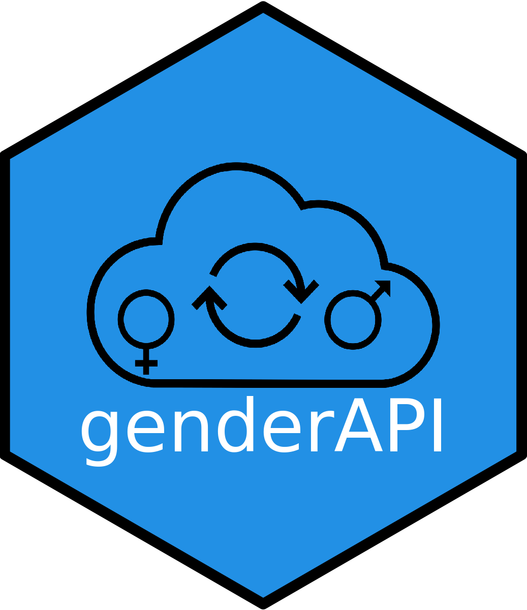

# genderAPI <a href='https://github.com/hugofitipaldi/genderAPI'></a>

```{r echo = FALSE}
library(badger)
```

<!-- badges: start --->

<!-- [](https://cran.r-project.org/package=covidsymptom) -->
<!--  -->
<!-- `r badge_devel("csss-resultat/covidsymptom", "blue")` -->
<!-- `r badge_lifecycle("experimental", "orange")` -->
<!-- `r badge_last_commit("csss-resultat/covidsymptom")` -->

<!-- badges: end -->

<!-- ```{r, include = FALSE} -->
<!-- knitr::opts_chunk$set( -->
<!--   collapse = TRUE, -->
<!--   comment = "#>", -->
<!--   fig.path = "man/figures/README-", -->
<!--   out.width = "100%" -->
<!-- ) -->
<!-- ``` -->


The `genderAPI` R package is a wrapper for Gender-API.com, the biggest platform on the internet to estimate gender by name, surname and country of origin. The package supports both the legacy v1 API and the new v2 API with enhanced features including country of origin detection, ethnicity analysis, and batch processing.


## Installation

Development version of the package can be installed from Github with:

``` r
install.packages("remotes")
remotes::install_github("hugofitipaldi/genderAPI")
```
## API Authentication

First, you will need an API Key, you can create your free account [here](https://gender-api.com/en/). A free account at Gender-API.com gives you 500 credits for free every month.

For the v2 API functions, you'll need a Bearer token which can be found in your account dashboard.

```{r warning=FALSE, message=FALSE, eval = FALSE}
# Store your API credentials
api_key <- "your_v1_api_key"        # For legacy functions
api_token <- "your_v2_bearer_token" # For v2 functions
```

## Test Your Connection

```{r warning=FALSE, message=FALSE, eval = FALSE}
library(genderAPI)

# Test API connection
test_api_connection("Hugo", api_token)
```

```
## ✓ API connection successful! Gender API is working properly.
```

## Basic Usage

### Legacy API (v1) - Simple Gender Prediction

```{r warning=FALSE, message=FALSE, eval = FALSE}
library(genderAPI)
get_gender(name = "Camila", country_code = "BR", api_key = your_api_key)
```

```
##     name country gender accuracy
## 1 camila      BR female       98
```

## Query with last name (v1 API)

```{r warning=FALSE, message=FALSE, eval = FALSE}
library(genderAPI)
get_gender(name = "Daniel", country_code = "BR", api_key = your_api_key, last_name = "Fitipaldi")
```

```
##   first_name last_name country gender accuracy
## 1     Daniel Fitipaldi      BR   male      100
```

## Enhanced Features with v2 API

### Gender Prediction by First Name

The v2 API provides more detailed information including probability scores and processing statistics:

```{r warning=FALSE, message=FALSE, eval = FALSE}
# Basic gender prediction
result <- get_gender_v2("Hugo", api_token)
print(result)
```

```
##   first_name gender probability result_found country samples credits_used duration
## 1       Hugo   male        0.99         TRUE      NA   35618            1     27ms
```

**If you use this package in you research, please cite:**

Hugo Fitipaldi, Paul W Franks, *Ethnic, gender and other sociodemographic biases in genome-wide association studies for the most burdensome non-communicable diseases: 2005–2022, Human Molecular Genetics, 2022*;, ddac245, https://doi.org/10.1093/hmg/ddac245


