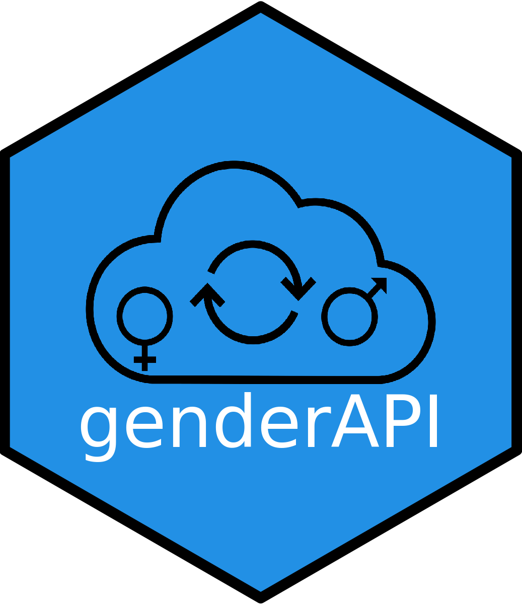

# genderAPI <a href='https://github.com/hugofitipaldi/genderAPI'></a>

<!-- badges: start --->
<!-- [](https://cran.r-project.org/package=covidsymptom) -->
<!--  -->
<!-- [](https://github.com/csss-resultat/covidsymptom) -->
<!-- [](https://lifecycle.r-lib.org/articles/stages.html#experimental) -->
<!-- [](https://github.com/csss-resultat/covidsymptom/commits/main) -->
<!-- badges: end -->
<!-- ```{r, include = FALSE} -->
<!-- knitr::opts_chunk$set( -->
<!--   collapse = TRUE, -->
<!--   comment = "#>", -->
<!--   fig.path = "man/figures/README-", -->
<!--   out.width = "100%" -->
<!-- ) -->
<!-- ``` -->

The `genderAPI` R package is a wrapper for Gender-API.com, the biggest
platform on the internet to estimate gender by name, surname and country
of origin.

## Installation

Development version of the package can be installed from Github with:

``` r
install.packages("remotes")
remotes::install_github("hugofitipaldi/genderAPI")
```

## Usage

First, you will need an API Key, you can create your free account
[here](https://gender-api.com/en/). A free account at Gender-API.com
gives you 500 credits for free every month.

``` r
library(genderAPI)
get_gender(name = "Camila", country_code = "BR", api_key = your_api_key)
```

    ##     name country gender accuracy
    ## 1 camila      BR female       98

## Query with last name

``` r
library(genderAPI)
get_gender(name = "Daniel", country_code = "BR", api_key = your_api_key, last_name = "Fitipaldi")
```

    ##   first_name last_name country gender accuracy
    ## 1     Daniel Fitipaldi      BR   male      100

**If you use this package in you research, please cite:**

Hugo Fitipaldi, Paul W Franks, *Ethnic, gender and other
sociodemographic biases in genome-wide association studies for the most
burdensome non-communicable diseases: 2005–2022, Human Molecular
Genetics, 2022*;, ddac245, <https://doi.org/10.1093/hmg/ddac245>
